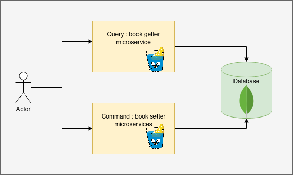
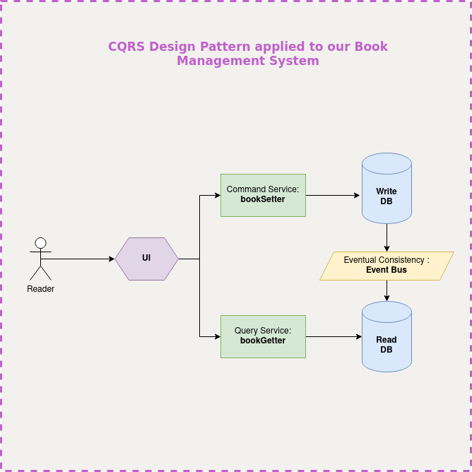
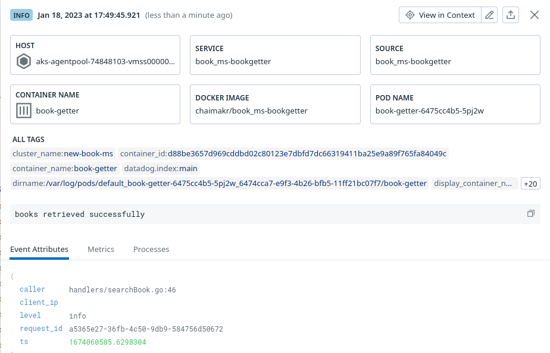
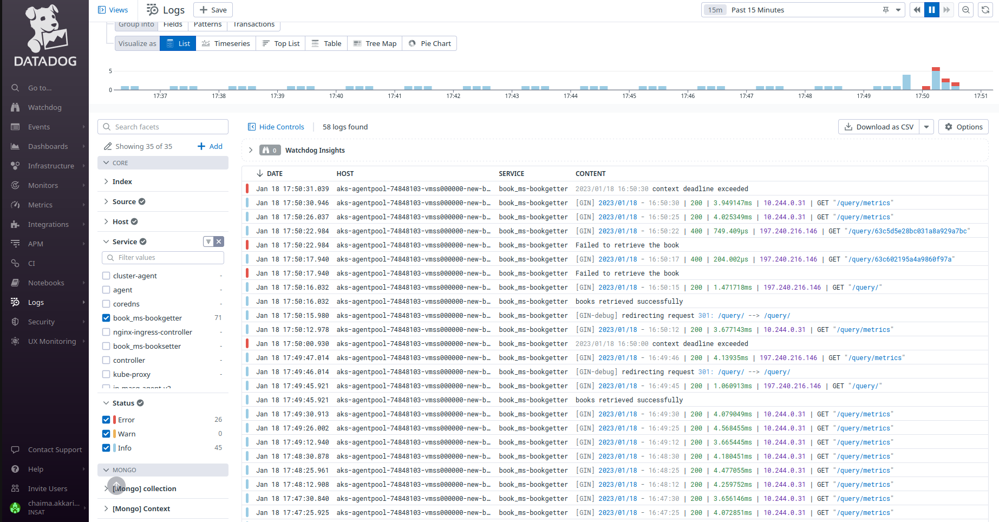
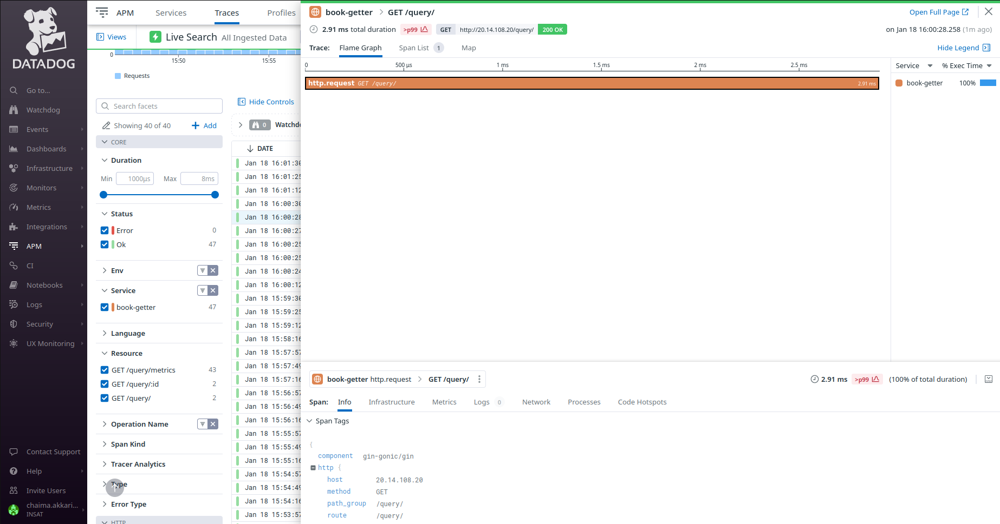
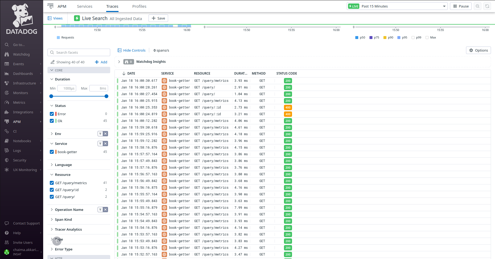
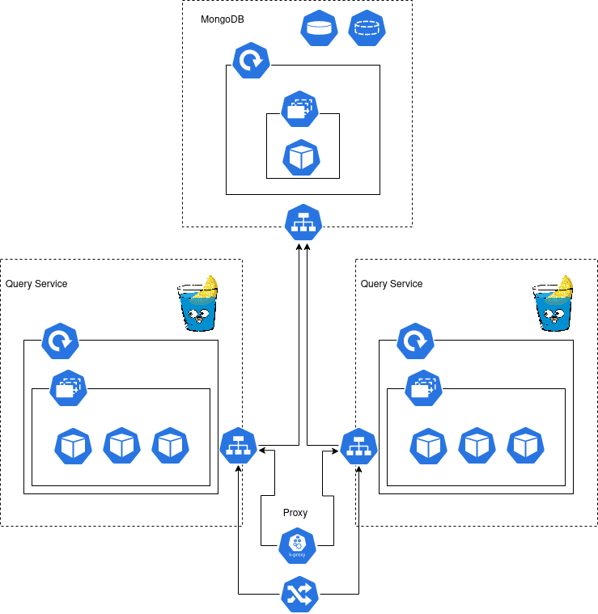

# Book Management system 
The main idea is to implement a crud application following the CQRS design pattern  
### Components 
*Query or Book-getter* : is a gin microservice that retrieve data from the database : get one or all books  
*Command or book-setter* : is a gin the microservice that modify the database: insert, update & delete
 
*Database* : a mongodb instance
 

## Existing Architecture (WIP)

  

## Final Aim 

  

## Observability

### Logging & Traces
I used datadog to persist and visualise the application logs, the attribute added to each log are request_id and ip_adress(not working for now)

  

The logs dashboard :

  

A trace example

  

The traces dashboard :

  

  

